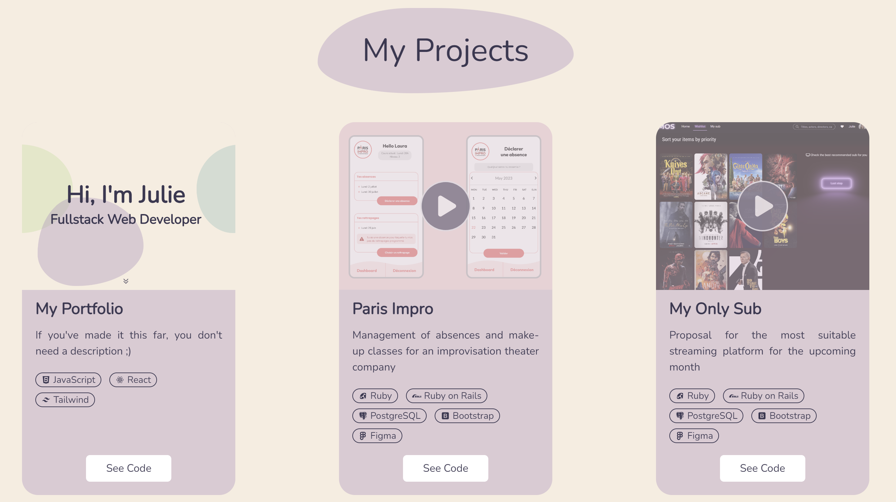

<br />
<a name="readme-top"></a>
<br />
<div align="center">
  <a href="https://github.com/jlbrunet/portfolio">
    
  </a>
  <h3 align="center">Portfolio</h3>
  <p align="center">
     Welcome to my portfolio! This project showcases my coding journey and various projects I've worked on. 
    <br />
    <br />
  </p>
</div>

<details>
  <summary>Table of Contents</summary>
  <ol>
    <li>
      <a href="#about-the-project">About The Project</a>
      <ul>
        <li><a href="#built-with">Built With</a></li>
      </ul>
    </li>
    <li>
      <a href="#getting-started">Getting Started</a>
      <ul>
        <li><a href="#prerequisites">Prerequisites</a></li>
        <li><a href="#installation">Installation</a></li>
        <li><a href="#installation">Available scripts</a></li>
      </ul>
    </li>
    <li><a href="#roadmap">Roadmap</a></li>
    <li><a href="#contact">Contact</a></li>
  </ol>
  <br />
</details>


## About The Project

<br />
<div align="center"></div>
<br />

<p>This portfolio serves as a window into my world, where you can explore not only who I am but also the projects that define my skills and passions.</p>


### Built With

* [![React][React.js]][React-url]
* [![Tailwind][Tailwind.com]][Tailwind-url]
<br />

## Getting Started

### Prerequisites

* npm
  ```sh
  npm install npm@latest -g
  ```


### Installation

1. Clone the repo
   ```sh
   git clone https://github.com/github_username/repo_name.git
   ```
2. Install NPM packages
   ```sh
   npm install
   ```

   
### Available Scripts

Runs the app in the development mode :
```sh
npm run start
```
The page will reload when you make changes. You may also see any lint errors in the console.

Launches the test runner in the interactive watch mode :
```sh
npm run test
```
<br />

## Roadmap

- [x] Implement the Home, About, Projects, and Footer components in the React App.
    - [x] Implement a ScrollButton in the Home Component to smoothly navigate to the About section.
          A ScrollButton has been added to the Home component, allowing users to smoothly scroll to the About section for a better user experience.
- [x] Enhance the About Component with dynamic content, styling, and interactive elements.
    - [x] Implement a ScrollButton in the About Component to smoothly navigate to the Projects section.
          A ScrollButton has been added to the About component, allowing users to smoothly scroll to the Projects section for a better user experience.
- [x] Develop the Projects Component to showcase project cards, modals of the projects videos, and interactive features.
<br />


## Contact

juliebrunet.pro@outlook.fr

[https://github.com/jlbrunet/portfolio](https://github.com/jlbrunet/portfolio)

<!-- MARKDOWN LINKS & IMAGES -->
[React.js]: https://img.shields.io/badge/React-20232A?style=for-the-badge&logo=react&logoColor=61DAFB
[React-url]: https://reactjs.org/
[Tailwind.com]: https://img.shields.io/badge/Tailwind_CSS-38B2AC?style=for-the-badge&logo=tailwind-css&logoColor=white
[Tailwind-url]: https://tailwindcss.com/
